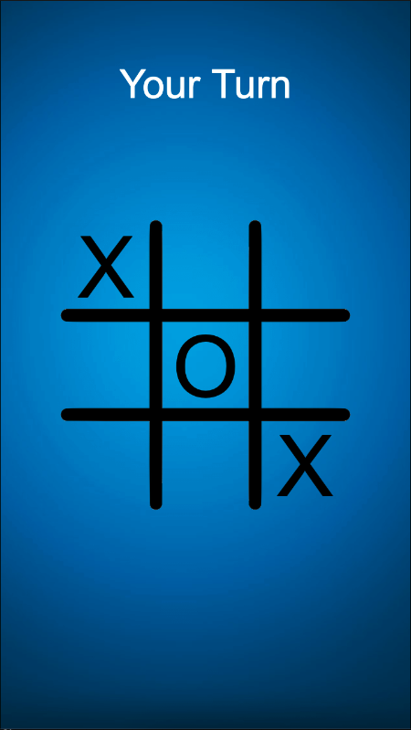
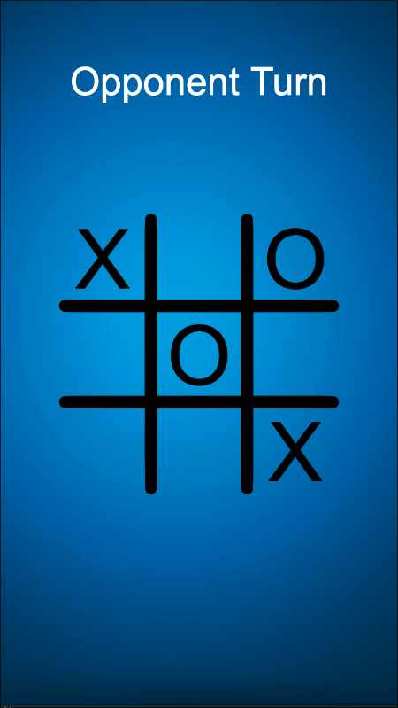

# 🎮 Multiplayer Tic-Tac-Toe

A real-time multiplayer Tic-Tac-Toe game built using Cocos Creator and Socket.IO.

---

## 🚀 Features
- Real-time multiplayer gameplay
- Turn-based system with synchronization
- Win / Draw detection
- Restart game functionality

---

## 🛠️ Tech Stack
- Cocos Creator (Client)
- Node.js (Server)
- Socket.IO (Real-time communication)

---

## 📁 Project Structure
- client/ → Cocos Creator game
- server/ → Node.js Socket.IO server

---

## 📜 Key Scripts
- NetworkManager.ts → Handles socket connection and events
- GameManager.ts → Game logic and board handling
- server.js → Room management and real-time sync
  
## 📸 Screenshots




---

## 🔧 How to Run

### 1. Start Server
```bash
cd server
npm install
node server.js

2. Run Client
Open client/ in Cocos Creator
Click Play


## 🧠 Multiplayer Logic
- Server manages game state using Socket.IO
- Clients send moves via events
- Server broadcasts updates to all players
- Turn synchronization handled on server side

## 🌐 Future Improvements
- Player reconnect handling
- Online deployment
- Matchmaking system

## 👨‍💻 Author
Priyesh Patel
